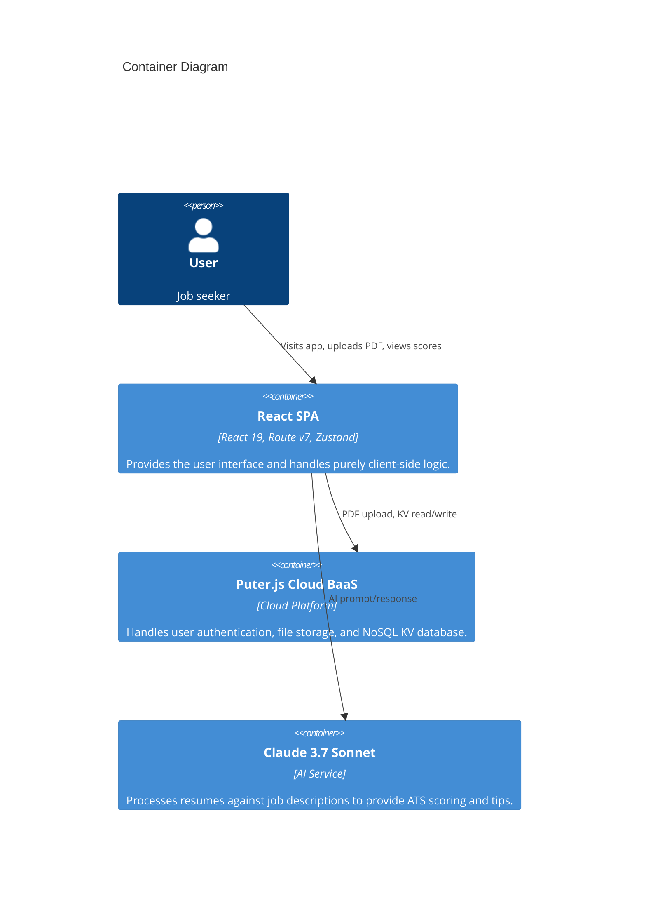
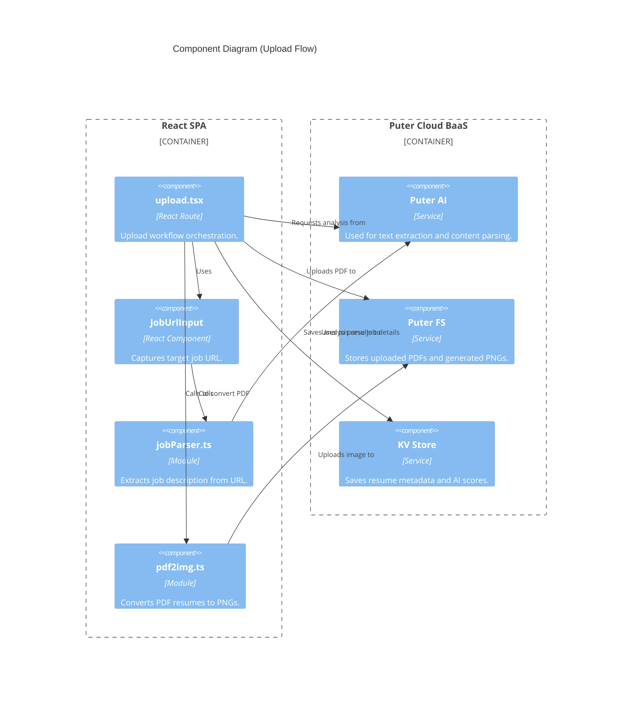
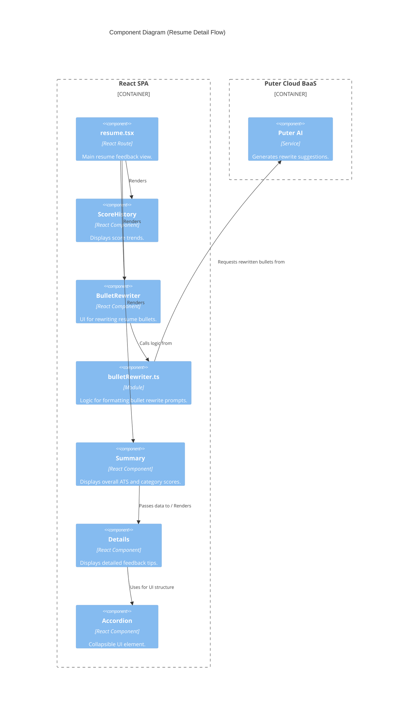

# Resumely Architecture Diagrams

## Diagram 1 — System Context

```mermaid
C4Context
    title System Context Diagram

    Person(user, "User", "A job seeker looking to optimize their resume.")
    System(resumely, "Resumely", "Resume optimization and ATS scoring platform.")
    
    System_Ext(puter, "Puter.js", "Auth + Storage + KV")
    System_Ext(claude, "Claude AI", "AI Provider (via Puter)")

    Rel(user, resumely, "Uses")
    Rel(resumely, puter, "Uses for Auth, Storage, KV")
    Rel(resumely, claude, "Sends prompts to")
    ```c4x
    %%{ c4: container }%%
    graph TB
    
    user[Person: User<br/>A job seeker looking to optimize their resume.]
    
    subgraph ResumelySystem {
        resumely[System: Resumely<br/>Resume optimization and ATS scoring platform.]
    }
    
    subgraph ExternalSystems {
        puter[System_Ext: Puter.js<br/>Auth / Storage / KV]
        claude[System_Ext: Claude AI<br/>AI Provider via Puter]
    }
    
    user -->|Uses| resumely
    resumely -->|Uses for Auth, Storage, and KV| puter
    resumely -->|Sends prompts to| claude

```

```c4x
%%{ c4: container }%%
graph TB
    user[User<br/>Person<br/>A job seeker looking to optimize their resume.]

    subgraph ResumelySystem {
        resumely[Resumely<br/>System<br/>Resume optimization and ATS scoring platform.]
    }

    subgraph ExternalServices {
        puter[Puter.js<br/>System_Ext<br/>Auth + Storage + KV]
        claude[Claude AI<br/>System_Ext<br/>AI Provider via Puter]
    }

    user -->|Uses| resumely
    resumely -->|Uses for Auth, Storage, KV| puter
    resumely -->|Sends prompts to| claude
```

## Diagram 2 — Container Diagram



## Diagram 3 — Component Diagram (Upload Flow)



## Diagram 4 — Component Diagram (Resume Detail Flow)


